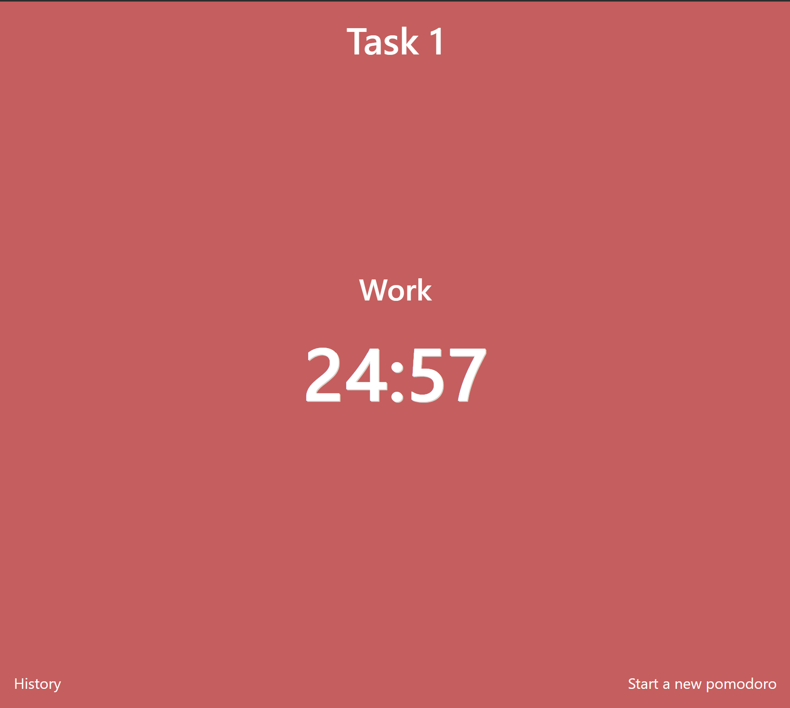

# Database

This project is configured to use mysql.

Start your mysql server and create a database, by default `pomodoro`.

Change the connection configuration in `backend/web/settings.py`

```
DATABASES = {
    'default': {
        'ENGINE': 'django.db.backends.mysql',
        'NAME': 'pomodoro',
        'USER': 'pomodoro',
        'PASSWORD': 'password',
        'HOST': 'localhost',
        'PORT': 3306
    }
}
```

# Backend

Make sure to have installes Python 3.

Go to backend directory

`cd backend`

Install dependencies

`pip install -r requirements.txt`

Run migrations

`python manage.py migrate`

Execute fixtures

```
python manage.py loaddata web/fixtures/initialdata.json
python manage.py loaddata web/fixtures/exampletasks.json
```

Start server

`python manage.py runserver`

Backend should be accessible through [http://localhost:8000](http://localhost:8000)

# Frontend

Make sure to have npm installes

Go to frontend directory

`cd frontend`

Install dependencies through npm

`npm install`

Start serving

`npm run serve`

Should be accessible through [http://localhost:8080](http://localhost:8080)

# Screenshots





